# parity

**Rebuild a website, and prove your copy matches.**

A Claude Code plugin. It reads how a site is built, rebuilds its pages in your project,
then measures both and tells you exactly where they differ.

## See it

```
$ node extractor/diff.js --reference capture.json --ours ours.json --map id-map.json

fidelity: /pricing

  page
    FAIL  page.layout.columns.rail.width: expected 400, got 376  (Δ24, tol 1)
  section-header
    FAIL  elements.title.typography.fontSize: expected 52, got 48  (Δ4, tol 0.5)
  plan-grid
    FAIL  grid.columns: expected 3, got 2  (Δ1, tol 0)
    FAIL  geometry.container: expected "content-column", got "rail"

  29 checks · 4 mismatches · 8 expected · 1 volatile module · 3 volatile fields
```

Exit `0` clean · `1` mismatches · `2` cannot compare.

## Install

```bash
claude --plugin-dir /path/to/parity   # local
/reload-plugins                         # pick up edits
```

Needs `node` and `python3`. Playwright is required only for clone-side capture and loads
lazily. Run `preflight.sh --project DIR` to check the environment.

## Quick start

```bash
/parity-bootstrap https://example.com   # once per project — studies the site, then stops
                                       # review its notes, mark them reviewed
/parity-page /pricing                   # build one page, stopping at each gate
/parity-page /pricing --verify-only     # re-measure after a fix
```

`/parity-page` refuses to build until the bootstrap notes are marked `reviewed`.

## Commands

| Command | When | Writes |
|---|---|---|
| `/parity-bootstrap <url>` | Once per project | `.parity/` artifact set, as `draft` |
| `/parity-page <route>` | Once per page | `pages/<route>/`, catalog + inventory updates |
| `/parity-sync` | When a parallel session finishes | Your session copy, or the shared notes |
| `/parity-improve` | Periodically | `TOOL-GAPS.md` |

| Flag | On | Effect |
|---|---|---|
| `--verify-only` | `clone-page` | Re-measure an already-built page |
| `--unattended` | `clone-page` | No gates. Template mode only, on an archetype already built once |
| `--per-page` · `--template` | `clone-page` | Force a build mode instead of the measured verdict |
| `--pull` · `--push` | `clone-sync` | Merge direction |
| `--tag <session>` | `clone-sync` | Operate on a named session |
| `--since` · `--write` | `clone-improve` | Filter by date · update the backlog |

## Workflow

```mermaid
flowchart TB
    subgraph EP1["Step 1 · Study the site — /parity-bootstrap, once per project"]
        direction TB
        S0["<b>S0 · Check what already exists</b><br/>stop if reviewed notes exist"]

        subgraph SURVEY["S1–S3 · Survey"]
            direction TB
            S1["<b>S1 · Learn your project's setup</b><br/>stack, ports, verify command"]
            S2["<b>S2 · List every page</b><br/>main nav, sub-navs, footer"]
            S3["<b>S3 · Group pages that share a layout</b><br/>matched on CSS class families"]
            S1 --> S2 --> S3
        end

        subgraph RECORD["S4–S6 · Write down the details"]
            direction TB
            S4["<b>S4 · Catalogue the reusable blocks</b><br/>each starts 'not built yet'"]
            S5["<b>S5 · Collect colours, fonts, spacing</b><br/>plus each font's role"]
            S6["<b>S6 · Ask what's out of scope</b><br/>so it's not mistaken for a bug"]
            S4 --> S5 --> S6
        end

        S0 --> S1
        S3 --> S4
        S6 --> S7["<b>S7 · Test the grouping</b><br/>on pages it has never seen"]
        S7 -->|"guessed wrong — regroup"| S3
        S7 -->|"guessed right"| S75{"<b>S7.5 · Worth reusing?</b><br/>2+ pages AND 70%+ right"}
        S75 --> S8["<b>S8 · Write up the findings</b><br/>draft — nothing can build yet"]
        S8 --> REV{"<b>You approve them</b>"}
        REV -->|"not yet — building is blocked"| S8
    end

    REV -->|"approved"| P0

    subgraph EP2["Step 2 · Build a page — /parity-page, once per page"]
        direction TB
        P0{"<b>P0 · Reusable layout?</b><br/>read from the notes"}
        P0 -->|"yes"| TPL["<b>Start from the shared layout</b><br/>reuse what exists, flag what's new"]
        P0 -->|"no, it's one of a kind"| PPG["<b>Start from this page alone</b><br/>all from its own measurements"]
        TPL --> P1
        PPG --> P1
        P1["<b>P1 · Measure the real page</b><br/>twice, to spot live content"]
        P1 -->|"doesn't fit the layout after all — switch"| PPG
        P1 --> P2["<b>P2 · Write the build notes</b><br/>the differences, or the whole page"]
        P2 --> P3["<b>P3 · Build the structure</b><br/>placeholder text, blocks tagged"]
        P3 --> P4{"<b>P4 · Does it match?</b><br/>field by field"}
        P4 -->|"no — fix and re-check"| P3
        P4 -->|"yes"| P5["<b>P5 · Add the real content</b><br/>written fresh, never copied"]
        P5 --> P6["<b>P6 · Compare again, and record</b><br/>real text wraps differently"]
        P6 -->|"next page"| P0
    end

    P6 --> SYNC["<b>Step 3 · Share what you learned</b><br/>/parity-sync --push"]
    SYNC -.->|"other sessions pick it up"| P0

    classDef same fill:#dcfce7,stroke:#15803d,color:#14532d
    classDef sameStop fill:#dcfce7,stroke:#15803d,color:#14532d,stroke-width:4px
    classDef differsStop fill:#fae8ff,stroke:#a21caf,color:#4a044e,stroke-width:4px
    classDef differs fill:#fae8ff,stroke:#a21caf,color:#4a044e
    classDef decide fill:#e0e7ff,stroke:#4338ca,color:#1e1b4b
    classDef decideStop fill:#e0e7ff,stroke:#4338ca,color:#1e1b4b,stroke-width:4px
    classDef share fill:#f1f5f9,stroke:#64748b,color:#0f172a
    class P3 same
    class P1,P5,P6 sameStop
    class P2 differsStop
    class TPL,PPG differs
    class S75,P0 decide
    class REV,P4 decideStop
    class SYNC share
```



**Thick border** = stops for your review. **Green** = same on every page. **Purple** =
depends on the page's layout. **Diamonds** = decisions. The inner boxes group steps that
run together.

## Two build modes

Each layout must be used by **2+ pages** and be right **70%+ of the time** on pages the
bootstrap never sampled. Otherwise its pages build per-page. Decided per page — real sites
mix strong layouts with one-offs.

| | shared layout | per-page |
|---|---|---|
| P0 | Read the layout, declare REUSE / EXTEND / NEW | No layout; expectations come from the capture |
| P2 | Notes record only the **differences** | Notes are **self-contained** |
| Reuse | Modules resolve REUSE/EXTEND | Modules start NEW; 2nd occurrence gets shared |

Capture, diff and every gate are identical. A page that turns out not to fit its layout
downgrades itself at P1 and records the miss.

## Parallel sessions

Several chats, one project. Each works on its own copy; merge when one finishes:

```bash
/parity-sync --push    # publish this session's findings
/parity-sync --pull    # pick up what others published
```

Entries merge by id, so two sessions adding different findings never collide. Shared
layouts, tokens and `SYSTEM_DESIGN.md` **stop and show you both versions** if two sessions
changed them.

## What lands in your project

```
.parity/
├── SYSTEM_DESIGN.md          the doc a new session reads instead of re-deriving
├── page-inventory.json       route → layout, build mode, status
├── module-catalog.json       every block, its component, where it appears
├── tokens.json               colours, type scale, font roles
├── templates/<archetype>.json  shared slots + the reuse verdict
├── scope-ledger.json         what you deliberately don't build
├── deviations.json           deliberate departures, so the diff expects them
├── id-map.json               their module names ↔ yours
├── pages/<route>/            capture.json · ours.json · spec.md
├── preflight.json            this project's own environment checks (optional)
├── tool-feedback.jsonl       gaps found in the tool itself (append-only)
└── sessions/<tag>/           only when sessions run in parallel
```

Nothing else in your project is written to. Existing scaffolding — build scripts, task
runners, `AGENTS.md`, `docs/` — is read for its rules and never modified.

## Plugin layout

```
parity/
├── commands/     parity-bootstrap · parity-page · clone-sync · clone-improve
├── skills/       capture-fidelity · module-reuse · scope-ledger
├── extractor/    extract.js · run-local.js · diff.js · volatility.js
│                 run-reference.md — the reference-capture protocol
├── hooks/        catalog-reminder.sh (silent unless bootstrapped)
├── templates/    ARTIFACTS.md — every artifact schema
├── preflight.sh
├── DESIGN.md     why it works this way
├── STOPGAPS.md   temporary deviations, and how to undo them
└── TOOL-GAPS.md  known gaps, ranked by how often they bite
```

`diff.js` and `volatility.js` have no dependencies and run anywhere.

The plugin holds **zero facts about any app** — only procedures for deriving them.
Everything app-specific lands in the target project under `.parity/`.

## Terms

| Term | Means |
|---|---|
| **capture** | JSON of everything measurable about one page — sizes, fonts, colours, positions, counts |
| **module** | One repeated block: a header, a story card, an ad slot |
| **archetype** | A layout several pages share |
| **deviation** | A difference you chose on purpose, so the check expects it |
| **scope ledger** | Features you decided not to build, so they aren't mistaken for bugs |

## Docs

| | |
|---|---|
| [`DESIGN.md`](DESIGN.md) | Why verification works this way — read before changing it |
| [`templates/ARTIFACTS.md`](templates/ARTIFACTS.md) | Every artifact schema |
| [`commands/`](commands/) | Each command, phase by phase |
| [`extractor/run-reference.md`](extractor/run-reference.md) | Capturing the reference side |
| [`TOOL-GAPS.md`](TOOL-GAPS.md) · [`STOPGAPS.md`](STOPGAPS.md) | Known gaps · temporary deviations |

## Limits

Passing the diff means every captured fact is reproduced — not that the page is
indistinguishable. It cannot see a wrong image, an awkward crop, or interaction feel.
Behaviour is recorded as agent observation and labelled as such.

Seed content is originally authored, never copied from the reference.
