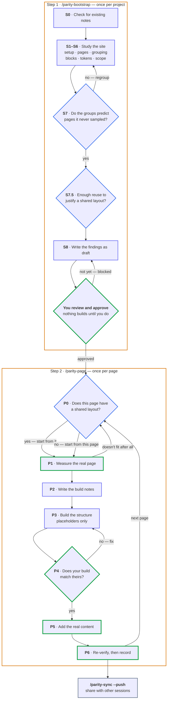

# parity

**Rebuild a website, and prove your copy matches.**

A Claude Code plugin. It reads how a site is built, rebuilds its pages in your project,
then measures both and tells you exactly where they differ.

## See it

```
$ node extractor/diff.js --reference capture.json --ours ours.json --map id-map.json

fidelity: /pricing

  page
    FAIL  page.layout.columns.rail.width: expected 400, got 376  (Δ24, tol 1)
  section-header
    FAIL  elements.title.typography.fontSize: expected 52, got 48  (Δ4, tol 0.5)
  plan-grid
    FAIL  grid.columns: expected 3, got 2  (Δ1, tol 0)
    FAIL  geometry.container: expected "content-column", got "rail"

  29 checks · 4 mismatches · 8 expected · 1 volatile module · 3 volatile fields
```

Exit `0` clean · `1` mismatches · `2` cannot compare.

## Install

Once, for every project on the machine — from inside Claude Code:

```
/plugin marketplace add atr0-0/parity
/plugin install parity@parity
```

That writes it to `~/.claude/`, so every repo you open has the commands. There is nothing
to add per project and nothing to vendor into one: the plugin resolves its own extractor
and templates through `${CLAUDE_PLUGIN_ROOT}`, and everything project-specific lives in
that project's `.parity/`. `/plugin update parity` pulls a new version.

To share it with a team, commit the enablement to the repo's `.claude/settings.json`:

```jsonc
{
  "extraKnownMarketplaces": {
    "parity": { "source": { "source": "github", "repo": "atr0-0/parity" } }
  },
  "enabledPlugins": { "parity@parity": true }
}
```

Working on parity itself, load it from disk instead — `claude --plugin-dir /path/to/parity`,
then `/reload-plugins` to pick up edits.

Needs `node` and `python3`. Playwright is required only for clone-side capture and loads
lazily. Run `preflight.sh --project DIR` to check the environment.

## Quick start

```bash
/parity-bootstrap https://example.com   # once per project — studies the site, then stops
                                       # review its notes, mark them reviewed
                                       # --scope /a,/b to work only on assigned routes
/parity-page /pricing                   # build one page, stopping at each gate
/parity-page /pricing --verify-only     # re-measure after a fix
```

`/parity-page` refuses to build until the bootstrap notes are marked `reviewed`.

## Commands

| Command | When | Writes |
|---|---|---|
| `/parity-bootstrap <url>` | Once per project | `.parity/` artifact set, as `draft` |
| `/parity-page <route>` | Once per page | `pages/<route>/`, catalog + inventory updates |
| `/parity-sync` | When a parallel session finishes | Your session copy, or the shared notes |
| `/parity-fix "<report>"` | A bug someone reported on a built page | The fix, plus catalog and feedback updates |
| `/parity-improve` | Periodically | `TOOL-GAPS.md` |

| Flag | On | Effect |
|---|---|---|
| `--verify-only` | `parity-page` | Re-measure an already-built page |
| `--unattended` | `parity-page` | No gates. Template mode only, on an archetype already built once |
| `--per-page` · `--template` | `parity-page` | Force a build mode instead of the measured verdict |
| `--pull` · `--push` | `parity-sync` | Merge direction |
| `--tag <session>` | `parity-sync` | Operate on a named session |
| `--route <route>` | `parity-fix` | Skip locating the page when you already know it |
| `--since` · `--write` | `parity-improve` | Filter by date · update the backlog |

## Workflow



**Reading it.** **Diamonds** are decisions; **green borders** mark the phases that stop and
wait for you. Every arrow is labelled, including the five that loop back — regroup, stay
blocked until you approve, switch a page off a layout it does not fit, fix and re-check,
and start the next page.

### Step 1 · `/parity-bootstrap` — once per project

| | What happens | What you do |
|---|---|---|
| **S0** | Reads existing `.parity/` state. Refuses to overwrite `reviewed` work | Answer refresh-or-stop |
| **S1** | Records the stack from your own config files — framework, styling, data-fetch pattern, dev-server URL, verify command | Answer anything it can't discover. It won't guess |
| **S2** | Crawls the reference: nav, sub-navs, footer | — |
| **S3** | Samples 2–3 pages per candidate group and clusters them, recording which signal it used | — |
| **S4** | Enumerates every distinct block per layout | — |
| **S5** | Extracts colours, type scale, spacing, and the font **role** map | — |
| **S6** | Asks once: anything out of scope, deferred, or stubbed? | Answer — empty is fine |
| **S7** | Tests its own clustering against pages it never sampled. Poor result → back to S3 | — |
| **S7.5** | Per layout: 2+ pages **and** 70%+ accurate, or its pages go per-page | — |
| **S8** | Writes every artifact as `draft`, reports, stops | **Review, then mark `reviewed`** |

Nothing builds until you promote them — that gate is what stops one wrong assumption
reaching ten pages.

### Step 2 · `/parity-page <route>` — once per page

| | What happens | Stops? |
|---|---|---|
| **P0** | Resolves the mode, declares reuse / extend / new per block | no |
| **P1** | Captures the reference **twice** — whatever differs between two identical captures is live content, and self-populates the ignore list | **yes** |
| **P2** | Writes the build notes: differences only, or the whole page | **yes** |
| **P3** | Builds structure with placeholder content, tagging each block `data-parity-module` | no |
| **P4** | Captures your page, diffs, loops until clean | **yes** |
| **P5** | Wires real data through your project's own pattern | **yes** |
| **P6** | Re-diffs with real content, updates the catalog, inventory and ledgers | **yes** |

P3 is untagged for a reason: without `data-parity-module` the extractor finds nothing on
your side and the diff has nothing to compare.

## Two build modes

Decided per page, because real sites mix strong layouts with one-offs. Only P0 and P2
differ — capture, diff and every gate are identical, which is why per-page is a real mode
and not a degraded one.

| | shared layout | per-page |
|---|---|---|
| P0 | Read the layout, declare reuse / extend / new | No layout; expectations come from the capture |
| P2 | Notes record only the **differences** | Notes are **self-contained** |
| Reuse | Blocks resolve reuse/extend | Blocks start new; the 2nd occurrence gets shared |

## When QA finds a bug

Whoever fixes it is usually in a fresh chat with none of the build context. `/parity-fix`
takes the report in plain words and works out the rest from the project's own artifacts:

```bash
/parity-fix "the newsletter box in the sidebar on /pricing is cut off"
```

It resolves the description to a page, a block and a component, then **checks your recorded
decisions before touching any code** — so a bug that turns out to be a deliberate choice
gets surfaced with its reasoning instead of silently undone.

Then it re-runs the diff, which sorts the report into one of three:

| The diff | Means |
|---|---|
| already flags it | The check worked; the build ignored it |
| is clean and the report is right | **The check has a blind spot** — logged so it gets fixed |
| is clean and the report is wrong | The build is correct, and here is the measurement |

The middle one matters most: a defect the check should have caught will let the next one
through too, so it is recorded against the tool, not just patched on the page.

Finally it names every other page using the block you changed — the shared-component fix
that quietly breaks a page nobody re-opened is the failure this closes.

It stops only twice: when the report is ambiguous or turns out to be a recorded decision,
and at the end if re-checking the affected pages would take real time.

## Joining a project midway

You are handed three routes on a rebuild that started months ago. A full bootstrap would
go and re-measure a site your teammates already built and wrote down.

Name what you own on the bootstrap:

```
/parity-bootstrap https://example.com --scope /board,/backlog
```

That writes `.parity/scope.json` and git-ignores it — it records *your* assignment, so it
must not reach a teammate's checkout.

`/parity-bootstrap` then **reads the repo before it reads the reference**. The block
catalog comes out of the components themselves, the tokens out of the theme config, the
conventions out of the project's own docs — no browser, nothing re-derived. It visits the
reference only for the routes you own, and writes a system design marked `partial` that
says which routes it covers.

| | routes you own | everything else |
|---|---|---|
| Build, edit, verify | yes | refused, and told whose it is |
| Read for reuse | yes | **yes — the whole repo, always** |
| Report findings | yes | not yours to act on |
| Warn before you break it | yes | **yes** |

The read/write split is the point: you have to see every component to reuse one, while
owning only three pages. And before you extend a shared block, parity names the other
routes that render it — derived from the import graph on day one, and replaced by the
exact list as pages get built. It over-reports rather than under-reports, and says which
kind it gave you.

Scope is an assignment, not a property of the project, so it never merges. With no
`scope.json`, nothing changes.

## Parallel sessions

Several chats, one project. Each works on its own copy; merge when one finishes:

```bash
/parity-sync --push    # publish this session's findings
/parity-sync --pull    # pick up what others published
```

Entries merge by id, so two sessions adding different findings never collide. Shared
layouts, tokens and `SYSTEM_DESIGN.md` **stop and show you both versions** if two sessions
changed them.

## What lands in your project

```
.parity/
├── SYSTEM_DESIGN.md          the doc a new session reads instead of re-deriving
├── page-inventory.json       route → layout, build mode, status
├── module-catalog.json       every block, its component, where it appears
├── tokens.json               colours, type scale, font roles
├── templates/<archetype>.json  shared slots + the reuse verdict
├── scope-ledger.json         what you deliberately don't build
├── deviations.json           deliberate departures, so the diff expects them
├── id-map.json               their module names ↔ yours
├── pages/<route>/            capture.json · ours.json · spec.md
│   └── <fixture>/            a state worth capturing on its own — empty, error, as-admin
├── preflight.json            this project's own environment checks (optional)
├── tool-feedback.jsonl       gaps found in the tool itself (append-only)
└── sessions/<tag>/           only when sessions run in parallel
```

Nothing else in your project is written to. Existing scaffolding — build scripts, task
runners, `AGENTS.md`, `docs/` — is read for its rules and never modified.

## Plugin layout

```
parity/
├── commands/     parity-bootstrap · parity-page · parity-fix · parity-sync · parity-improve
├── skills/       capture-fidelity · module-reuse · scope-ledger
├── extractor/    extract.js · run-local.js · diff.js · volatility.js
│                 run-reference.md — the reference-capture protocol
├── hooks/        catalog-reminder.sh (silent unless bootstrapped)
├── templates/    ARTIFACTS.md — every artifact schema
├── preflight.sh
├── DESIGN.md     why it works this way
├── STOPGAPS.md   temporary deviations, and how to undo them
└── TOOL-GAPS.md  known gaps, ranked by how often they bite
```

`diff.js` and `volatility.js` have no dependencies and run anywhere.

The plugin holds **zero facts about any app** — only procedures for deriving them.
Everything app-specific lands in the target project under `.parity/`.

## Terms

| Term | Means |
|---|---|
| **capture** | JSON of everything measurable about one page — sizes, fonts, colours, positions, counts |
| **fixture** | The state a capture was taken under — empty list, as-admin, past page 1. A route with state is not one page |
| **module** | One repeated block: a header, a story card, an ad slot |
| **archetype** | A layout several pages share |
| **deviation** | A difference you chose on purpose, so the check expects it |
| **scope ledger** | Features you decided not to build, so they aren't mistaken for bugs |

## Docs

| | |
|---|---|
| [`DESIGN.md`](DESIGN.md) | Why verification works this way — read before changing it |
| [`templates/ARTIFACTS.md`](templates/ARTIFACTS.md) | Every artifact schema |
| [`commands/`](commands/) | Each command, phase by phase |
| [`extractor/run-reference.md`](extractor/run-reference.md) | Capturing the reference side |
| [`TOOL-GAPS.md`](TOOL-GAPS.md) · [`STOPGAPS.md`](STOPGAPS.md) | Known gaps · temporary deviations |

## Limits

Passing the diff means every captured fact is reproduced — not that the page is
indistinguishable. It cannot see a wrong image, an awkward crop, or interaction feel.
Behaviour is recorded as agent observation and labelled as such.

Seed content is originally authored, never copied from the reference.
